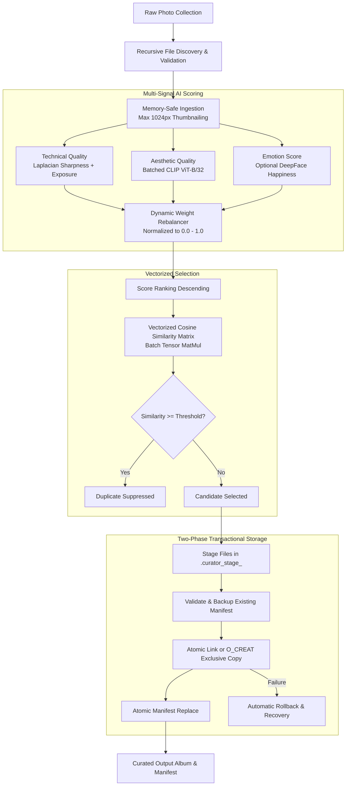

# 📸 Photo Curator

[](https://github.com/bhargavkukadiya/photo-curator/actions/workflows/ci.yml)
[](https://opensource.org/licenses/MIT)
[](https://www.python.org/downloads/)
[](test_album_selector.py)
[](https://pytorch.org/)
[%20%7C%20CUDA%20%7C%20CPU-orange.svg)]()
[]()

> **Production-grade, AI-powered photo curator that automatically ranks, deduplicates, and curates the best photos from large collections for your albums with full transactional safety.**

---

## 📑 Table of Contents

- [✨ Features](#-features)
- [🧠 How It Works](#-how-it-works)
- [⚡ Performance & Benchmarks](#-performance--benchmarks)
- [📦 Installation](#-installation)
- [🚀 Quick Start](#-quick-start)
- [⚙️ Advanced Usage](#️-advanced-usage)
- [🛠️ CLI Reference](#️-cli-reference)
- [📊 Preview CSV Schema](#-preview-csv-schema)
- [🖼️ Supported Formats](#️-supported-formats)
- [🛡️ Transactional Safety & Security](#️-transactional-safety--security)
- [🧪 Testing & Development](#-testing--development)
- [🤝 Community & Contributing](#-community--contributing)
- [📄 License & Acknowledgements](#-license--acknowledgements)

---

## ✨ Features

- 🎯 **Multi-Signal AI Quality Engine**:
  - **Technical Quality (40%)**: Standardized Laplacian variance for edge sharpness plus normalized luminance exposure.
  - **Aesthetic Quality (40%)**: Batched OpenAI CLIP (`ViT-B/32`) cosine similarity scored against configurable semantic reference prompts.
  - **Facial Emotion Detection (20%, optional)**: DeepFace facial analysis to prioritize genuine smiles and joy in group and portrait photos.
- ⚡ **Vectorized Burst-Shot Deduplication**: Rapid PyTorch tensor matrix comparison (`torch.matmul`) suppressing redundant burst shots by embedding cosine similarity (`--dedup_threshold`).
- 🛡️ **Two-Phase Transactional Commit**:
  - Isolated temporary staging (`.curator_stage_*`) with automatic rollback on errors.
  - Non-destructive JSON manifest tracking (`.curator_manifest.json`) and untracked-file protection.
  - Cross-filesystem atomic fallback (`O_CREAT | O_EXCL`) preserving original file metadata (`copystat`).
- 💾 **Memory-Efficient Batch Ingestion**: Downsamples high-resolution photos (48MP/60MP) after decode, reducing dual-buffer working RAM from ~288 MB to ~4.72 MB per image (~151 MB for a batch of 32) to prevent batch memory accumulation.
- 🚀 **Hardware Accelerated**: Native zero-configuration acceleration for Apple Silicon (`mps`), NVIDIA GPUs (`cuda`), and multi-core `cpu`.
- 📊 **Actionable Dry-Run & CSV Previews**: Preview rankings with explicit status annotations (`Selected`, `Duplicate_Suppressed`, `Rank_Cutoff`) before executing file copies.
- 🧪 **Comprehensive In-Memory Test Suite**: 87 unit tests running in under 3 seconds with mocked neural models.

---

## 🧠 How It Works



---

## ⚡ Performance & Benchmarks

Photo Curator includes vectorized PyTorch batch operations and ingestion memory downscaling designed for large photo libraries (DSLR, Mirrorless, and modern smartphones):

| Operation / Metric | Previous Baseline | Optimized (v1.1.0) | Notes |
|---|---|---|---|
| **Burst Deduplication (5,000 photos)** | `4.245s` (Scalar loop) | **`0.114s`** (Vectorized) | **37× faster** batch matrix similarity |
| **Retained Buffers per 48MP Photo (8000×6000)** | ~288 MB retained (Dual PIL RGB + OpenCV BGR) | **~4.72 MB** retained (Dual 1024px buffers) | **>98% retained buffer reduction** |
| **Retained Batch Memory (32 Photos in RAM)** | ~9.2 GB uncompressed | **~151 MB** downscaled | Prevents cumulative batch accumulation |
| **Transient Decode Peak (Single 48MP JPEG)** | ~569 MiB peak RSS | ~569 MiB peak RSS | Full-resolution initial decode & EXIF transpose |
| **Test Suite Execution (87 tests)** | N/A | **~2.4s** | Fast isolated mock & unit tests |

> [!NOTE]
> While initial image decompression and EXIF orientation transpose temporarily allocate full uncompressed raster memory (~569 MiB peak transient RSS for an 8000×6000 JPEG), dimension-capped thumbnailing immediately shrinks the retained in-memory buffers (both PIL RGB and OpenCV BGR) to ~4.72 MB combined per photo (~151 MB total for a batch of 32), preventing cumulative memory exhaustion during large album processing.

---

## 📦 Installation

### Option 1: Install from Source (Recommended)

```bash
# 1. Clone the repository
git clone https://github.com/bhargavkukadiya/photo-curator.git
cd photo-curator

# 2. Create and activate a virtual environment
python3 -m venv .venv
source .venv/bin/activate  # On Windows: .venv\Scripts\activate

# 3. Install core dependencies
pip install -e .
```

After installation, the `photo-curator` CLI command is globally available in your environment.

### Option 2: Install with Optional Extras

```bash
# Optional: Facial emotion scoring (DeepFace)
pip install -e ".[emotion]"

# Optional: Apple/Android HEIC & HEIF photo support
pip install -e ".[heic]"

# Install everything (Core + Emotion + HEIC + Test Suite)
pip install -e ".[all,dev]"
```

> [!NOTE]
> On the first run, the CLIP model (`clip-ViT-B-32`, ~350 MB) downloads automatically and caches locally in `~/.cache/torch/sentence_transformers/`.

---

## 🚀 Quick Start

### 1. Basic Curation
Select the top 50 photos from a collection and copy them to `./selected` with zero-padded index prefixes:

```bash
photo-curator --input ./my_photos --output ./selected --target 50
```

### 2. Dry Run with Burst Deduplication & CSV Preview
Score all photos, eliminate redundant burst shots with similarity $\ge 0.90$, and export full rankings to a CSV file without copying:

```bash
photo-curator \
  --input ./sample_photos \
  --output ./album \
  --target 5 \
  --dedup_threshold 0.90 \
  --no_deepface \
  --preview_csv preview_scores.csv \
  --dryrun
```

Sample output rankings on included sample photos:

| Photo | Total Score | Technical | Aesthetic | Emotion | Status |
|---|---|---|---|---|---|
| `city_night.jpg` | **0.6832** | 0.9774 | 0.3889 | 0.0000 | `Selected` |
| `beach_sunset.jpg` | **0.6786** | 0.9836 | 0.3737 | 0.0000 | `Selected` |
| `ocean.jpg` | **0.6477** | 0.9603 | 0.3351 | 0.0000 | `Selected` |
| `mountain.jpg` | **0.6374** | 0.9361 | 0.3387 | 0.0000 | `Selected` |
| `flower.jpg` | **0.6303** | 0.8938 | 0.3668 | 0.0000 | `Selected` |
| `forest.jpg` | **0.6158** | 0.8541 | 0.3775 | 0.0000 | `Rank_Cutoff` |
| `bright_field.jpg` | **0.6081** | 0.8396 | 0.3765 | 0.0000 | `Rank_Cutoff` |
| `dark_alley.jpg` | **0.4870** | 0.6433 | 0.3308 | 0.0000 | `Rank_Cutoff` |
| `portrait.jpg` | **0.4526** | 0.5598 | 0.3455 | 0.0000 | `Rank_Cutoff` |
| `blurry_abstract.jpg` | **0.3825** | 0.3549 | 0.4102 | 0.0000 | `Rank_Cutoff` |

---

## ⚙️ Advanced Usage

### Custom Scoring Weights

Customize curation for landscape and architectural photography (e.g. 50% sharpness, 50% aesthetics, zero emotion):

```bash
photo-curator \
  --input ./nature_trip \
  --output ./album \
  --no_deepface \
  --weight_technical 0.5 \
  --weight_aesthetic 0.5
```

> [!TIP]
> When `--no_deepface` is passed or emotion scoring is unavailable, weights automatically rebalance dynamically so the composite score always spans the full `[0.0, 1.0]` scale.

### Hardware Acceleration

```bash
# Apple Silicon (M1 / M2 / M3 / M4)
photo-curator --input ./photos --output ./album --device mps --batch_size 32

# NVIDIA CUDA
photo-curator --input ./photos --output ./album --device cuda --batch_size 64

# Multi-Core CPU
photo-curator --input ./photos --output ./album --device cpu --batch_size 16
```

### Custom Aesthetic Prompts

Tailor aesthetic scoring for specific album themes:

```bash
# Family portraits
photo-curator --input ./family --output ./album --ref_text "a warm happy family portrait with natural lighting"

# Architectural photography
photo-curator --input ./travel --output ./album --ref_text "stunning architecture sharp symmetrical award-winning photograph"
```

---

## 🛠️ CLI Reference

| Flag | Type | Default | Description |
|---|:---:|:---:|---|
| `--input` | `Path` | *required* | Directory containing photos (scanned recursively). |
| `--output` | `Path` | *required* | Destination directory for selected photos. |
| `--target` | `int` | `200` | Target number of top photos to select. |
| `--batch_size` | `int` | `32` | Batch size for neural CLIP inference. |
| `--device` | `str` | `cpu` | PyTorch execution device (`cpu`, `cuda`, or `mps`). |
| `--preview_csv` | `Path` | `None` | Export full rankings and selection status to CSV. |
| `--ref_text` | `str` | `"a beautiful photograph"` | Reference semantic prompt for aesthetic scoring. |
| `--weight_technical` | `float` | `0.4` | Weight for technical quality (sharpness + exposure). |
| `--weight_aesthetic` | `float` | `0.4` | Weight for CLIP aesthetic quality. |
| `--weight_emotion` | `float` | `0.2` | Weight for facial emotion happiness score. |
| `--dedup_threshold` | `float` | `None` | Cosine similarity threshold `[0.0-1.0]` for duplicate suppression (e.g. `0.90`). |
| `--no_deepface` | `flag` | `false` | Disable facial emotion detection. |
| `--overwrite` | `flag` | `false` | Allow overwriting non-empty output directories or existing preview CSV. |
| `--dryrun` | `flag` | `false` | Score and rank photos without copying any files. |

---

## 📊 Preview CSV Schema

When `--preview_csv <filename>.csv` is passed, Photo Curator writes a structured report with the following columns:

| Column | Type | Example | Description |
|---|:---:|:---:|---|
| `Path` | `str` | `photos/sunset.jpg` | Source photo path relative to current working directory. |
| `TotalScore` | `float` | `0.6786` | Normalized composite quality score `[0.0000, 1.0000]`. |
| `Technical` | `float` | `0.9836` | Sharpness (Laplacian variance) + balanced exposure score. |
| `Aesthetic` | `float` | `0.3737` | Rescaled CLIP cosine similarity against `--ref_text`. |
| `Emotion` | `float` | `0.0000` | Average happiness score across detected faces `[0.0, 1.0]`. |
| `Status` | `str` | `Selected` | Selection outcome: `Selected`, `Duplicate_Suppressed`, or `Rank_Cutoff`. |

---

## 🖼️ Supported Formats

| Format | Extension | Decoder Engine | Notes |
|---|---|:---:|---|
| **JPEG** | `.jpg`, `.jpeg` | Pillow / OpenCV | Automatic EXIF orientation transpose |
| **PNG** | `.png` | Pillow / OpenCV | Full 8-bit & 16-bit RGB/RGBA support |
| **WebP** | `.webp` | Pillow / OpenCV | Lossy and lossless WebP support |
| **BMP** | `.bmp` | Pillow / OpenCV | Standard uncompressed bitmaps |
| **TIFF** | `.tiff`, `.tif` | Pillow / OpenCV | Multi-channel and grayscale TIFFs |
| **HEIC / HEIF** | `.heic`, `.heif` | `pillow-heif` | Requires `pip install pillow-heif` |

---

## 🛡️ Transactional Safety & Security

Photo Curator enforces strict filesystem integrity guarantees:

1. **Two-Phase Atomic Commit**: Files are copied into an isolated temporary folder (`.curator_stage_<hash>`). Only upon successful scoring and staging are files moved to the destination folder via atomic links or `O_CREAT | O_EXCL` exclusive stream copy.
2. **Automatic Rollback**: If an exception or filesystem error occurs mid-transaction (disk full, permission denied, I/O failure), changes are rolled back to the prior state and backup files are restored. *(Note: Uncaught process termination signals like SIGINT/SIGKILL bypass Python exception handlers).*
3. **Path Traversal Protection**: Manifest entries are strictly checked against directory escape (`..`, `/`).
4. **Symlink Rejection**: Manifests and tracked entries reject symlinks to prevent symlink clobbering attacks.
5. **Untracked File Safety**: Photo Curator will never delete or overwrite untracked user files present in the output folder.

---

## 🧪 Testing & Development

Run the test suite:

```bash
# Run all 87 unit tests
pytest -v

# Run with verbose traceback
pytest test_album_selector.py -vv

# Syntax compilation check
python3 -m py_compile album_selector.py test_album_selector.py
```

All 87 tests execute in-memory with mocked ML models—no GPU or model downloads required.

---

## 🤝 Community & Contributing

Contributions are warmly welcomed! Please review our community documents:
- [Contributing Guide](CONTRIBUTING.md) — Setup, code style, and PR guidelines.
- [Code of Conduct](CODE_OF_CONDUCT.md) — Community standards and enforcement.
- [Security Policy](SECURITY.md) — Vulnerability reporting and disclosure.
- [Changelog](CHANGELOG.md) — Historical release notes.

---

## 📄 License & Acknowledgements

- Licensed under the [MIT License](LICENSE).
- **Core AI Technologies**:
  - [OpenAI CLIP](https://github.com/openai/CLIP) via [sentence-transformers](https://www.sbert.net/)
  - [DeepFace](https://github.com/serengil/deepface) by Sefik Ilkin Serengil (optional emotion detection, GPL-3.0)
  - [OpenCV](https://opencv.org/) & [Pillow](https://python-pillow.org/)
